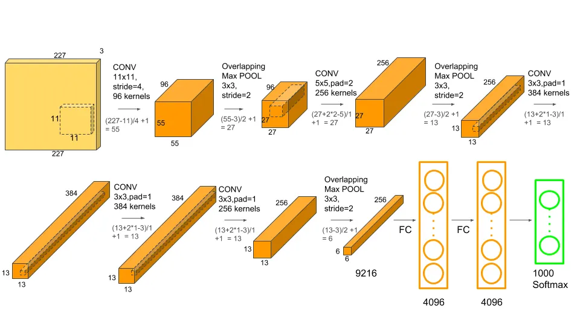

# AlexNet Implementation in PyTorch

A from-scratch implementation of the AlexNet architecture using PyTorch, based on the original 2012 paper "ImageNet Classification with Deep Convolutional Neural Networks" by Krizhevsky et al.



## 📋 Table of Contents

- [Features](#features)
- [Project Structure](#project-structure)
- [Requirements](#requirements)
- [Installation](#installation)
- [Dataset Structure](#dataset-structure)
- [Usage](#usage)
- [Configuration](#configuration)
- [Model Architecture](#model-architecture)
- [References](#references)

## ✨ Features

- Complete AlexNet architecture implementation
- Custom dataset loader for image classification
- Training and validation pipeline
- Model checkpointing
- Loss and accuracy visualization
- Inference script for predictions
- Configurable hyperparameters

## 📁 Project Structure

```
AlexNet/
├── README.md                 # Project documentation
├── requirements.txt          # Python dependencies
├── alexnetarch.png          # Architecture diagram
├── train_model.py           # Main training script
├── predict.py               # Inference script
├── src/
│   ├── model.py            # AlexNet model definition
│   ├── dataset.py          # Custom dataset class
│   ├── training.py         # Training and validation logic
│   └── load_data.py        # Data loading utilities
└── utils/
    ├── config.py           # Configuration settings
    └── visualize.py        # Plotting utilities
```

## 📦 Requirements

- Python 3.8+
- PyTorch 2.0+
- torchvision
- Pillow
- matplotlib
- numpy

## 🚀 Installation

1. **Clone the repository** (or navigate to the AlexNet directory):
   ```bash
   cd /path/to/AlexNet
   ```

2. **Install dependencies**:
   ```bash
   pip install -r requirements.txt
   ```

## 📂 Dataset Structure

Organize your dataset in the following structure:

```
your_dataset/
├── train/
│   ├── class1/
│   │   ├── image1.jpg
│   │   ├── image2.jpg
│   │   └── ...
│   ├── class2/
│   │   └── ...
│   └── classN/
│       └── ...
└── val/
    ├── class1/
    │   └── ...
    ├── class2/
    │   └── ...
    └── classN/
        └── ...
```

**Update the dataset paths** in `utils/config.py`:
```python
TRAIN_DATA = "/path/to/your/dataset/train"
VAL_DATA = "/path/to/your/dataset/val"
```

## 💻 Usage

### Training

To train the model:

```bash
python train_model.py
```

This will:
- Load the training and validation datasets
- Initialize the AlexNet model
- Train for the specified number of epochs
- Display training/validation loss and accuracy
- Plot loss curves after training

### Inference

To make predictions on new images:

```python
from src.model import AlexNet
from predict import predict_image
import torch

# Load your trained model
model = AlexNet(num_classes=5)
model.load_state_dict(torch.load('path/to/checkpoint.pth'))
model.eval()

# Make prediction
prediction = predict_image(model, 'path/to/image.jpg')
print(f"Predicted class: {prediction}")
```

## ⚙️ Configuration

All hyperparameters and settings are centralized in `utils/config.py`:

```python
class Config:
    # Dataset paths
    TRAIN_DATA = "/path/to/train"
    VAL_DATA = "/path/to/val"
    
    # Hyperparameters
    LEARNING_RATE = 0.01
    BATCH_SIZE = 32
    EPOCHS = 100
    NUM_CLASSES = 5
    IMG_SIZE = 256
    
    # Device
    DEVICE = "cuda" if torch.cuda.is_available() else "cpu"
```

**Modify these values** according to your dataset and computational resources.

## 🏗️ Model Architecture

The implementation follows the original AlexNet architecture:

### Convolutional Layers:
1. **Conv1**: 96 filters, 11×11 kernel, stride 4 → ReLU → LRN → MaxPool
2. **Conv2**: 256 filters, 5×5 kernel, stride 1 → ReLU → LRN → MaxPool
3. **Conv3**: 384 filters, 3×3 kernel, stride 1 → ReLU
4. **Conv4**: 384 filters, 3×3 kernel, stride 1 → ReLU
5. **Conv5**: 256 filters, 3×3 kernel, stride 1 → ReLU → MaxPool

### Fully Connected Layers:
1. **FC1**: 4096 units → ReLU → Dropout(0.5)
2. **FC2**: 4096 units → ReLU → Dropout(0.5)
3. **FC3**: NUM_CLASSES units (output layer)

**Input**: 227×227×3 RGB images  
**Output**: Class probabilities for NUM_CLASSES classes

## 📊 Training Details

- **Optimizer**: SGD with momentum (0.9) and weight decay (0.0005)
- **Loss Function**: Cross-Entropy Loss
- **Data Augmentation**:
  - Random horizontal flip
  - Random crop (227×227)
  - Normalization (ImageNet statistics)

## 📖 References

- **Original Paper**: [ImageNet Classification with Deep Convolutional Neural Networks](https://papers.nips.cc/paper/2012/file/c399862d3b9d6b76c8436e924a68c45b-Paper.pdf)
- **Authors**: Alex Krizhevsky, Ilya Sutskever, Geoffrey E. Hinton
- **Year**: 2012

## 📝 Notes

- The model expects input images of size 227×227 (after cropping from 256×256)
- Local Response Normalization (LRN) is used as in the original paper
- Adjust `BATCH_SIZE` based on your GPU memory
- Training on CPU will be significantly slower

## 🤝 Contributing

Feel free to open issues or submit pull requests for improvements!

## 📄 License

This implementation is for educational purposes.
