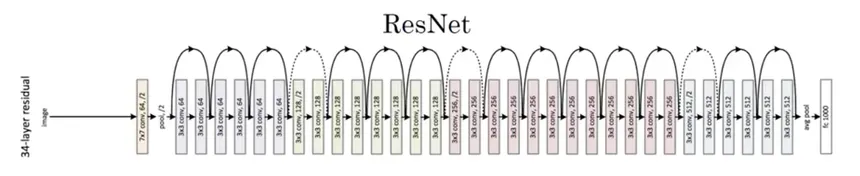

# ResNet-18 from Scratch (PyTorch)

A from-scratch PyTorch implementation of **ResNet-18** from [*Deep Residual Learning for Image Recognition*](https://arxiv.org/abs/1512.03385) (He et al., 2015), trained for image classification on a custom 6-class dataset.

No `torchvision.models` shortcuts: the residual block, the stage builder, and the full network are written by hand.

## Architecture



*Figure from the original paper. It shows the 34-layer network; this repo implements the 18-layer variant, which uses the same building blocks with fewer of them per stage.*

The core idea is the **residual (skip) connection**. Instead of learning a mapping `H(x)` directly, each block learns the residual `F(x)` and outputs `F(x) + x`. This makes very deep networks much easier to optimize.

- **Solid arrows** in the figure are identity shortcuts: the input is added straight onto the block's output.
- **Dotted arrows** are projection shortcuts: when a stage halves the resolution and doubles the channels, a 1x1 strided convolution + batch norm reshapes the input so the addition is valid. This is the `downsample` module in `model.py`.

### ResNet-18 layout

Output sizes below are for this repo's 256x256 input.

| Stage | Layers | Output size |
|-------|--------|-------------|
| `conv` | 7x7 conv, 64, stride 2, then 3x3 max pool, stride 2 | 64 x 64 x 64 |
| `layer1` | 2 x basic block (64) | 64 x 64 x 64 |
| `layer2` | 2 x basic block (128), first block stride 2 | 32 x 32 x 128 |
| `layer3` | 2 x basic block (256), first block stride 2 | 16 x 16 x 256 |
| `layer4` | 2 x basic block (512), first block stride 2 | 8 x 8 x 512 |
| head | global average pool, then fully connected | 6 classes |

Each **basic block** contains two 3x3 convolutions with batch norm and a skip connection. In total: 1 stem conv + 16 block convs + 1 FC layer = 18 weighted layers.

## Project Structure

```
ResNet/
├── assets/
│   └── resnet_architecture.png
├── src/
│   ├── model.py         # ResidualBlock and ResNet18
│   ├── dataset.py       # CustomDataset (one folder per class)
│   ├── load_data.py     # builds train/val DataLoaders
│   └── training.py      # train_and_val loop with loss/accuracy tracking
├── utils/
│   ├── config.py        # paths, hyperparameters, transforms
│   └── visualize.py     # loss curve plotting
└── scripts/
    └── train_model.py   # entry point   <-- adjust if yours lives elsewhere
```

## Dataset

`CustomDataset` expects one sub-folder per class, with `.jpg`, `.jpeg`, or `.png` images:

```
data/
├── train/
│   ├── class_a/
│   ├── class_b/
│   └── ...          # 6 classes
└── val/
    ├── class_a/
    ├── class_b/
    └── ...
```

Class indices are assigned from the sorted folder names.

**Dataset used:** TODO (name / source, number of images, and the 6 class names)

## Training Setup

| Setting | Value |
|---------|-------|
| Input size | 256 x 256 |
| Optimizer | SGD, momentum 0.9, weight decay 5e-4 |
| Learning rate | 0.01 (constant) |
| Batch size | 32 (train), 16 (val) |
| Epochs | 100 |
| Loss | Cross-entropy |
| Augmentation | Horizontal flip (p = 0.5) |
| Normalization | ImageNet mean/std |
| Initialization | Random (no pretrained weights) |

All of these live in `utils/config.py` (the optimizer is set in `train_model.py`).

## Getting Started

```bash
git clone https://github.com/ma74a/paper-implementations.git
cd paper-implementations/ResNet

pip install torch torchvision pillow matplotlib
```

1. Put your data in the layout above.
2. Open `utils/config.py` and set `TRAIN_DATA` and `VAL_DATA` to your own paths, and `NUM_CLASSES` to match your dataset.
3. Train:

```bash
python scripts/train_model.py
```

Per-epoch train/val loss and accuracy are printed to the console, and a train-vs-validation loss curve is shown when training finishes. A CUDA GPU is used automatically if available.

## Results

| Metric | Train | Validation |
|--------|-------|------------|
| Accuracy | TODO | TODO |
| Loss | TODO | TODO |

TODO: add your loss/accuracy curve image here.

## Differences from the Paper

- **Depth:** 18 layers (basic blocks, `[2, 2, 2, 2]`); the paper's figure above shows the 34-layer network.
- **Task and input size:** 6-class classification at 256x256, instead of ImageNet's 1000 classes at 224x224.
- **Training recipe:** the paper uses SGD with lr 0.1 (divided by 10 on plateau), batch size 256, and weight decay 1e-4. This repo uses lr 0.01, batch size 32, weight decay 5e-4, and no learning-rate schedule.
- **Augmentation:** resize + horizontal flip only, without the paper's scale augmentation and random crops.

## Ideas for Next Steps

- Add a learning-rate scheduler
- Add checkpoint saving and an inference script
- Extend to ResNet-34 and ResNet-50 (bottleneck blocks)
- TODO: your own ideas

## Reference

He, K., Zhang, X., Ren, S., Sun, J. *Deep Residual Learning for Image Recognition.* CVPR 2016. [arXiv:1512.03385](https://arxiv.org/abs/1512.03385)

## Author

**Mahmoud Etman**: [GitHub](https://github.com/ma74a) · [LinkedIn](https://www.linkedin.com/in/mahm0ud-etman/)
