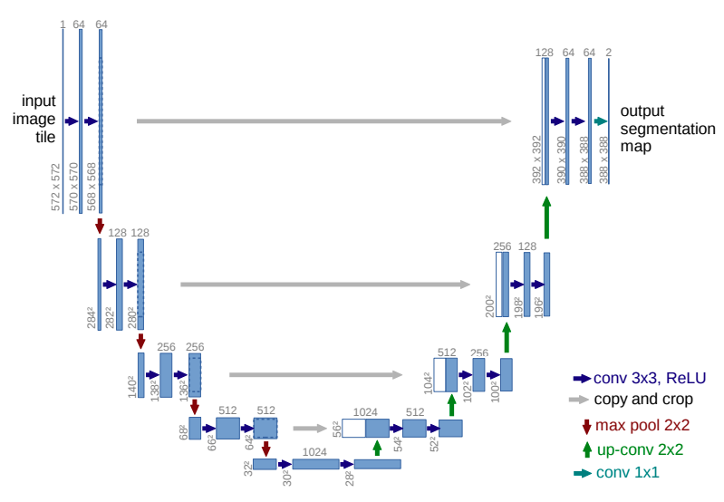

# U-Net — Image Segmentation

A PyTorch implementation of the [U-Net](https://arxiv.org/abs/1505.04597) architecture for binary semantic segmentation.

---

## Architecture

The network follows the classic encoder–bottleneck–decoder structure with skip connections:

| Block | Details |
|-------|---------|
| `DoubleConv` | Conv2d → BatchNorm → ReLU (×2), `padding=1` preserves spatial size |
| `Down` (×4) | MaxPool2d(2×2) → DoubleConv — halves spatial dims, doubles channels |
| Bottleneck | DoubleConv (512 → 1024 channels) |
| `Up` (×4) | ConvTranspose2d → concat skip connection → DoubleConv |
| Output | 1×1 Conv2d → `num_classes` channels |

Channel progression: **3 → 64 → 128 → 256 → 512 → 1024** (encoder), then reversed in the decoder.

---

