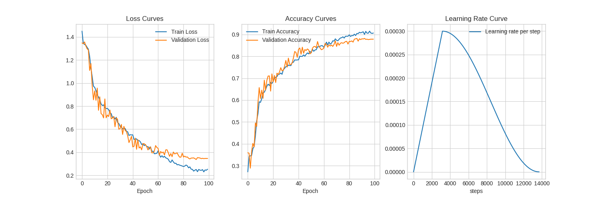

# Vision Transformer (ViT) — Image Classification from Scratch

A clean PyTorch implementation of the **Vision Transformer (ViT)** for image classification, trained end-to-end with a warmup + cosine learning-rate schedule, Hydra-based configuration, and a demo app for inference.

<p align="center">
  
</p>

> Based on the paper [*An Image is Worth 16x16 Words: Transformers for Image Recognition at Scale*](https://arxiv.org/abs/2010.11929) (Dosovitskiy et al., 2020).

---

## Table of Contents

- [Overview](#overview)
- [Architecture](#architecture)
- [Project Structure](#project-structure)
- [Installation](#installation)
- [Dataset Preparation](#dataset-preparation)
- [Training](#training)
- [Results](#results)
- [Inference](#inference)
- [Demo App](#demo-app)
- [Configuration](#configuration)
- [References](#references)

---

## Overview

Instead of using convolutions, ViT treats an image as a **sequence of patches** and processes it with a standard Transformer encoder. This project implements the full pipeline:

- Patch embedding + learnable `[class]` token + positional embeddings
- Transformer encoder blocks (Multi-Head Self-Attention + MLP, pre-LayerNorm, residual connections)
- MLP classification head
- Training loop with LR warmup and cosine decay
- Experiment logging, saved metrics, and training curves
- Inference script and a demo app

## Architecture

The image is split into fixed-size patches, each patch is flattened and linearly projected, a learnable `[class]` embedding is prepended, and position embeddings are added. The resulting sequence goes through `L` stacked Transformer encoder blocks. The final `[class]` token representation is passed to an MLP head to produce class logits.

### Transformer Encoder block

<p align="center">
  
</p>

Each of the `L` blocks applies:

1. `LayerNorm → Multi-Head Self-Attention → residual add`
2. `LayerNorm → MLP → residual add`

## Project Structure


```text
ViT/
├── configs/              # Hydra configuration files
├── images/               # Images used in this README
├── models/               # Saved model checkpoints
├── outputs/              # Hydra run outputs (logs, metrics, curves)
│   └── <date>/<run>/
│       ├── .hydra/                  # Resolved config for the run
│       ├── *.log                    # Training log
│       ├── learning_rates_per_step.csv
│       ├── mapping_saved_file.json  # Class-to-index mapping
│       ├── training_curves.png
│       └── training_history.csv
├── src/
│   ├── dataset.py        # Dataset & dataloaders
│   ├── model.py          # ViT implementation
│   └── split_data.py     # Train/val split utility
├── app.py                # Demo app
├── inference.py          # Run predictions on new images
├── train.py              # Training entry point
├── pyproject.toml        # Dependencies (managed with uv)
├── uv.lock
└── .python-version
```

## Installation

This project uses [uv](https://github.com/astral-sh/uv) for dependency management.

```bash
# Clone the repository
git clone https://github.com/<your-username>/<repo-name>.git
cd <repo-name>

# Create the environment and install dependencies
uv sync

# Activate it
source .venv/bin/activate        # Linux / macOS
.venv\Scripts\activate           # Windows
```

## Dataset Preparation

Organize your dataset in an `ImageFolder`-style layout:

```text
data/
├── class_a/
│   ├── img_001.jpg
│   └── ...
├── class_b/
│   └── ...
└── ...
```

Then split it into train / validation sets:

```bash
python src/split_data.py
```

The class-to-index mapping is saved to `mapping_saved_file.json` in the run output folder so inference uses the same label order as training.

## Training

```bash
python train.py
```

Hydra handles configuration, so any value in `configs/` can be overridden from the command line:

```bash
python train.py epochs=100 lr=3e-4 batch_size=64
```

> Adjust the override keys to match the names in your config files.

Each run creates a timestamped folder under `outputs/` containing the config snapshot, logs, per-epoch metrics, per-step learning rates, and the training curves.

**Training setup**

| Setting        | Value                                   |
| -------------- | --------------------------------------- |
| Epochs         | 100                                     |
| Peak LR        | 3e-4                                    |
| LR schedule    | Linear warmup → cosine decay to 0       |
| Total steps    | ~13,700                                 |
| Loss           | Cross-entropy                           |

## Results

<p align="center">
  
</p>

| Metric              | Train  | Validation |
| ------------------- | ------ | ---------- |
| Final loss          | ~0.25  | ~0.35      |
| Final accuracy      | ~91%   | ~88%       |

**Observations**

- Loss falls steadily and accuracy climbs smoothly throughout training, with train and validation tracking each other closely for the first ~60 epochs.
- After roughly epoch 60 a modest generalization gap opens (train ≈ 91% vs. validation ≈ 88%) as the learning rate decays, which is typical for ViTs trained on smaller datasets.
- The warmup + cosine schedule keeps early training stable (the usual ViT failure point) and lets the model settle into a stable minimum at the end.

## Inference

```bash
python inference.py --image path/to/image.jpg
```

The script loads the trained weights from `models/`, applies the same preprocessing used during validation, and prints the top predicted classes with their probabilities.

## Demo App

```bash
python app.py
```

Upload an image through the web interface to get the predicted class and confidence scores.

## Configuration

All hyperparameters live in `configs/` and are managed with [Hydra](https://hydra.cc/). Typical options include:

- Image size and patch size
- Embedding dimension, number of heads, number of encoder layers, MLP ratio
- Dropout rate
- Batch size, epochs, optimizer, learning rate, warmup steps
- Data paths and augmentations

## References

- Dosovitskiy et al., [*An Image is Worth 16x16 Words*](https://arxiv.org/abs/2010.11929), ICLR 2021
- Vaswani et al., [*Attention Is All You Need*](https://arxiv.org/abs/1706.03762), NeurIPS 2017

## License

Released under the MIT License. See `LICENSE` for details.